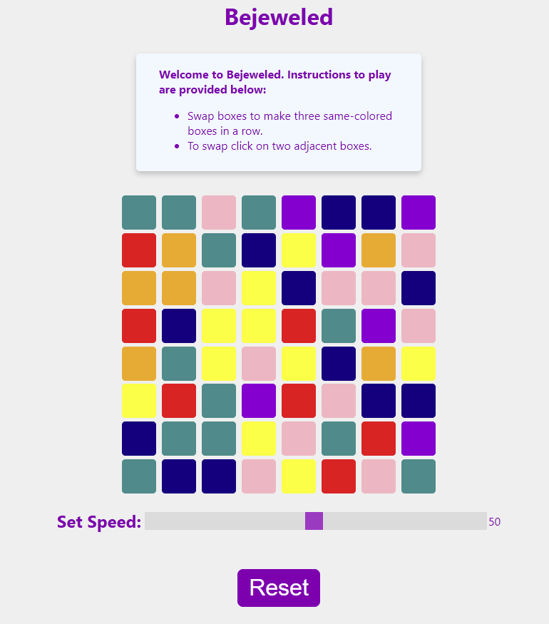

# Bejeweled

-This repo contains an implementation of the Bejeweled game.
-The primary goal is to implement a rendering of the grid portion of the bejeweled game.
-When rendered, the solution should display the grid, and there should be an easy way (eg, refresh the
page, click a “new grid button”) to generate a new grid.
-The grid should have cells of 7 different colors.

# Tech Stack

The following technology was used to build the application:

- React.js
- Javascript
- HTML
- CSS

## Getting Started:

### git clone https://github.com/hdoshi2/bejeweled-hd.git
### cd bejeweled-hd
### npm install
### npm run start

Open [http://localhost:3000](http://localhost:3000) to view it in your browser.
The page will reload when you make changes.\
You may also see any lint errors in the console.

# Getting Started with Create React App

This project was bootstrapped with [Create React App](https://github.com/facebook/create-react-app).

